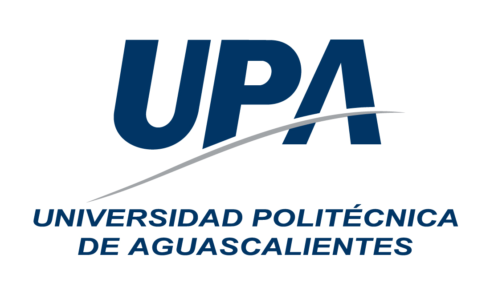

UP210043_CPP 

## Universidad Polítecnica de Aguascalientes  
  

## Kenya Talí Cornejo Granados
Up210043   
ISC03A  
 ## U1
<e1>
<li>01_Hola</li>
<li>02_Par Impar</li> 
<li>03_Tipos de datos</li>
<li>04_Ciclos</li>
<li>05_Edades</li> 
</e>
  
 ## U2  
<e1>
<li>01_Rentas</li>
<li>02_Rendimiento</li> 
<li>03_SalaJuegos</li>
<li>04_Pizzería</li>
<li>05_Temperaturas</li> 
<li>05_Compras</li> 
<li>06_BinDec</li> 
</e1>   
  

#  Git Commands  
Main commands for git;
<e2>
<li>git clone</li>
<li>git add .</li> 
<li>git status</li>
<li>git commit -m ""</li>
<li>git push</li> 
<li>git pull</li> 

</e2> 