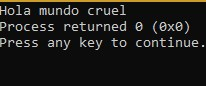
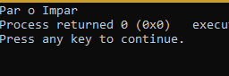
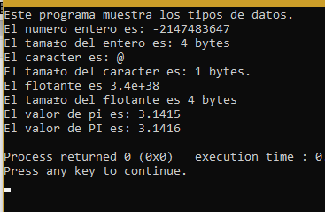
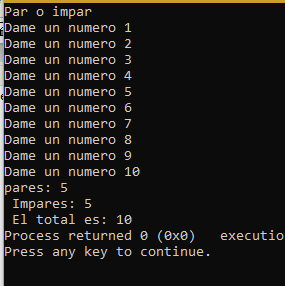
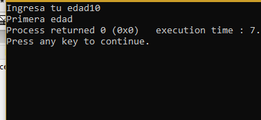

# Unit 1  

Kenya Talí Cornejo Granados
   
<h2>Exercises:  </h2>
<e1>
<li>01_Hola</li>
<li>02_Par Impar</li> 
<li>03_Tipos de datos</li>
<li>04_Ciclos</li>
<li>05_Edades</li> 
</e>
  
<h2>01_Hola </h2>

___    
This code shows the message "Hola mundo cruel" on console.  
   

<h2>02_ParImpar </h2>

___    
This code shows the message "Par o Impar" on console.  
 

<h2>03_TiposdeDatos </h2>

___    
This code shows the type of data accepted on c++ and their length.  
   
<h2>04_Ciclos </h2>

___    
This code uses a for cycle to read 10 numbers, then analizes how many are pairs, and how many are odds.    
 

<h2>05_Edades </h2>

___    
For this code you have to enter your age, and then it will display in wich  phase of your life you are.  
 