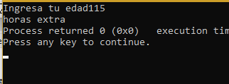

# Unit 1  
<center>Kenya Talí Cornejo Granados</center>   
<h2>Exercises:  </h2>
<e1>
<li>01_Hola</li>
<li>02_Par Impar</li> 
<li>03_Tipos de datos</li>
<li>04_Ciclos</li>
<li>05_Edades</li> 
</e>
  
<h2>01_Hola </h2>

___    
This code shows the message "Hola mundo cruel" on console.  
[Hola code](https://github.com/UP210043/UP210043_CPP/blob/main/U1/01_Hola.cpp)   
```
/* Objetivo: MOstar el mensaje "Hola mundo cruel" en consola*/
#include <iostream>
using namespace std;
int main ()
    {
        cout<<"Hola mundo cruel";
        return 0; 
```  
     

<h2>02_ParImpar </h2>

___    
This code shows the message "Par o Impar" on console.  
[Par Impar code](https://github.com/UP210043/UP210043_CPP/blob/main/U1/02_ParImpar.cpp)
 ```
/*Objetivo: mostrar el mensaje "Par o impar en consola"*/
#include <iostream>
using namespace std;

int main()
{
    cout<<"Par o Impar" ;
    return 0;
} 
```
 

<h2>03_TiposdeDatos </h2>

___    
This code shows the type of data accepted on c++ and their length.  
[Tipos de datos code](https://github.com/UP210043/UP210043_CPP/blob/main/U1/03_TiposdeDatos.cpp)  
```
 /*   Objetivo: Muestra los diferentes tipos de datos en c++
*/

#include <iostream>
#include <stdio.h>
using namespace std;
#define PI 3.1416
const float pi=3.1415;

int main()
{
    int entero = -2147483647;
    float flotante = 3.4e38;
    double grande = 2.23859823578572;
    char caracter = '@';

    cout << "Este programa muestra los tipos de datos. \n";
    cout << "El numero entero es: " << entero << endl;
    cout << "El tamaño del entero es: " << sizeof(entero) << " bytes" << endl;
    cout << "El caracter es: "<< caracter << endl;
    cout << "El tamaño del caracter es: " << sizeof(caracter) << " bytes." << endl;
    cout << "El valor de pi es: " << pi << endl;
    cout << "El valor de PI es: " << PI << endl;
  

    return 0;
}
```
   
<h2>04_Ciclos </h2>

___    
This code uses a for cycle to read 10 numbers, then analizes how many are pairs, and how many are odds.  
[Ciclos code](https://github.com/UP210043/UP210043_CPP/blob/main/U1/04_Ciclos.cpp)    
```
/*Objetivo: Determinar si un numero es par o impar y contar la cantidad de cada uno*/
#include <iostream>
using namespace std;
int main(int argc, char const *argv[])
{
    int n, res,par=0, impar=0;
    cout<<"Par o impar" <<"\n";
    for(int i=1; i<=10;i++)
    {
    cout<<"Dame un numero ";
    cin>>n;
    res=n%2;
    if(res==0)
    {
    par++;
    }
    else
    {
        impar++;
    }
    }

    cout<<"pares: "<<par<<"\n Impares: "<<impar;
    cout<<"\n El total es: "<<impar+par;
    return 0;
}

```
 

<h2>05_Edades </h2>

___    
For this code you have to enter your age, and then it will display in wich  phase of your life you are.  
[Edades code](https://github.com/UP210043/UP210043_CPP/blob/main/U1/05_edades.cpp)  
```
/*Objetivo: Identificar la etapa de la vida en la que se uncuentra una persona
basada en su edad
1-30 Primera edad
31-60 Segunda edad
61-90 Tercera edad
+90 Horas extra*/
#include <iostream>
using namespace std;
int main()
{
    int ed;
    cout << "Ingresa tu edad";
    cin >> ed;
    if (ed > 150 && ed <= 0)
    {
        cout << "Edad fuera de rango";
    }
    else
    {
        if (ed >= 1 && ed <= 30)
        {
            cout << "Primera edad";
            }
        else if (ed > 30 && ed <= 60)
        {
            cout << "segunda edad";
        }
        else if (ed > 60 && ed <= 90)
        {
            cout << "Tercera edad";
        }
        else
        {
            cout << "horas extra";
        }
    }
    return 0;
}
```
  
