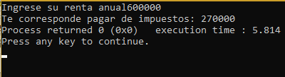
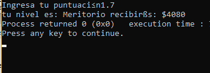
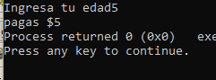
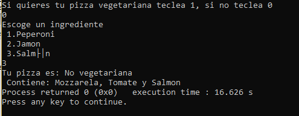
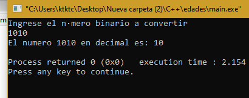

# Unit 2 
<center>Kenya Talí Cornejo Granados</center>   
<h2>Exercises:  </h2>
<e1>
<li>01_Rentas</li>
<li>02_Rendimiento</li> 
<li>03_SalaJuegos</li>
<li>04_Pizzería</li>
<li>05_Temperaturas</li> 
<li>05_Compras</li> 
<li>06_BinDec</li> 
</e>
  
<h2>01_Rentas </h2>

___    
This code shows how many taxes you are going to pay depending on how much you pay for rent in a year.  
[Rentas code](https://github.com/UP210043/UP210043_CPP/blob/main/U2/01_rentas.cpp)   

```
/*los tramos impositivos para la declaración de la renta en un determinado país son los siguientes
renta                       impuesto
menos de 10,0000            5
entre 10,000 y 20,000       15
entre 20.000 y 35000        20
entre 35000 y 60,000        30
mas de 60,000               45

Programa que pregunte al usuario su renta anual y muestre por pantalla el impuesto que le corresponde */
#include <iostream>
using namespace :: std;
int main()
{
    int rent;
    float porc, imp;
    cout<<"Ingrese su renta anual";
    cin>> rent;
    if (rent<10000)
    {
        porc=0.05;
    }
    else if (rent>=10000 && rent<20000)
    {
        porc=0.15;
    }
    else if (rent>=20000 && rent<35000)
    {
        porc=0.20;
    }
    else if (rent>=35000 && rent<60000)
    {
        porc=0.30;
    }
    else
    {
        porc=0.45;
    }
    imp=rent*porc;
    cout<< "Te corresponde pagar de impuestos: "<<imp;
    return 0;

}
```
 
  

<h2>02_Rendimiento </h2>

___    
This code shows the punctuation of the employees of a  company and how money they are going to get based on their punctuation.  
[Rendimiento code](https://github.com/UP210043/UP210043_CPP/blob/main/U2/02_rendiminto.cpp)  
```
/*En una determinada empresa, sus empleados son evaluados al final de cada año. Los puntos que pueden obtener
en la evaluación comienzan en 0.0 y pueden ir aumentando, traduciéndose en mejores beneficios. Los puntos que
pueden conseguir los empleados pueden ser 0.0, 0.4, 0.6 o más, pero no valores intermedios entre las cifras
mencionadas. Acontinuación se muestra una tabla con los niveles correspondientes a cada puntuación.
La cantidad de dinero conseguida en cada nivel es de $2,400 multiplicada por la puntuación del nivel.
Inaceptable 0.0
Aceptable 0.4
Meritorio 0.6 o más
Escribir un programa que lea la puntuación del usuario e indique su nivel de rendimiento, así como la
cantidad de dinero que recibirá el usuario.*/
#include <iostream>
using namespace std;
int main(int argc, char const *argv[])
{
    double punt, din;
    string nivel;
    cout << "Ingresa tu puntuación";
    cin >> punt;
    if (punt == 0 || punt == 0.4 || punt >= 0.6)
    {
        if (punt == 0)
        {
            nivel = "Inaceptable";
        }
        else if (punt == 0.4)
        {
            nivel = "Aceptable";
        }
        else if (punt >= 0.6)
        {
            nivel = "Meritorio";
        }
        din = punt * 2400;
        cout << "tu nivel es: " << nivel << " recibirás: $" << din;
    }
    else
    {
        cout << "Puntuación inválida";
    }

    return 0;
}

```
 
 

<h2>03_SalaJuegos </h2>

___    
This code shows how many money a game room is going to charge to the people based on their age.  
[Sala de juegos code](https://github.com/UP210043/UP210043_CPP/blob/main/U2/03_salaJuegos.cpp)  
```
/*Escribir un programa para una empresa que tiene salas de juegos para todas las edades yquiere calcular de forma 
automática el precio que debe cobrar a sus clientes por entrar. Elprograma debe preguntar al usuario la edad 
del cliente y mostrar el precio de la entrada. Si el cliente es menor de 4 años puede entrar gratis, si tiene 
entre 4 y 18 años debe pagar $5ysi es mayor de 18 años, $10.*/
#include <iostream>
using namespace std;
int main(int argc, char const *argv[])
{
    int edad;
    cout<<"Ingresa tu edad";
    cin>>edad;
    if(edad<4)
    {
        cout<<"Entras gratis";
    }
    else if(edad>=4 && edad<=18)
    {
        cout<<"pagas $5";
    }
    else
    {
        cout<<"Pagas $10";
    }
    return 0;
}

```
  
  
<h2>04_Pizzeria </h2>

___    
This code if to know how a client wants their pizza if they want it vegeterian or not, and shows wich ingredients the pizza is going to have.  
[Pizzeria code](https://github.com/UP210043/UP210043_CPP/blob/main/U2/04_pizzeria.cpp)  
```
/*La pizzería Bella Napoli ofrece pizzas vegetarianas y no vegetarianas a sus clientes. Los
ingredientes para cada tipo de pizza aparecen a continuación. 
 Ingredientes vegetarianos: Pimiento y tofu.
 Ingredientes no vegetarianos: Peperoni, Jamón y Salmón. 
Escribir un programa que pregunte al usuario si quiere una pizza vegetariana o no, y enfunción de su respuesta 
le muestre un menú con los ingredientes disponibles para que elija. 
Solo se puede eligir un ingrediente además de la mozzarella y el tomate que están en todas las pizzas.
Al final se debe mostrar por pantalla si la pizza elegida es vegetariana o no y todos los
ingredientes que lleva.*/
#include <iostream>
using namespace std;
int main(int argc, char const *argv[])
{
    int veg, ingr;
    string elemento,tipo;
    cout<<"Si quieres tu pizza vegetariana teclea 1, si no teclea 0 \n";
    cin>>veg;
    if(veg==0)
    {
        tipo="No vegetariana";
        cout<<"Escoge un ingrediente \n 1.Peperoni \n 2.Jamon \n 3.Salmón \n";
        cin>>ingr;
        switch (ingr)
        {
        case 1:
            elemento="Peperoni";
            break;
        case 2:
            elemento="Jamon";
            break;
        case 3:
            elemento="Salmon";
            break;
        default:
            break;
        }
    }
    else
    {
        tipo="Vegetariana";
        cout<<"Teclea el numero del ingrediente que desees  \n 1.Pimiento \n 2.Tofu \n ";
        cin>>ingr;
        switch (ingr)
        {
        case 1:
            elemento="Pimiento";
            break;
        case 2:
            elemento="Tofu";
            break;
        default:
            break;
        }
    }

    cout<<"Tu pizza es: "<< tipo<< "\n Contiene: Mozzarela, Tomate y "<<elemento;
    return 0;
}

```
  
  

<h2>05_Temperaturas </h2>

___    
This code is to get 6 temperatures, find the mean, and get wich is the minimum an the maximum temperature registered.  
[Temperaturas code](https://github.com/UP210043/UP210043_CPP/blob/main/U2/05_Temperaturas.cpp)  
```
/*Hacer un programa en el que se ingresen 6 temperaturas y determine el promedio, la mas
baja y la mas alta*/
#include <iostream>
using namespace std;
int main(int argc, char const *argv[])
{
    double temp, may=0, men=100000, prom=0;
    for(int i=1;i<=6;i++)
    {
        cout<<"ingresa tu temperatura";
        cin>>temp;
        if(temp>may)
        {
            may=temp;
        }
        
        else if(temp<men)
        {
            men=temp;
        }
        prom=prom+temp;

    }
    prom=prom/6;
    cout<< "El promedio de las temperaturas es: "<<prom<<"\n La temperatura mas alta fue: "<<may<<"\n La temperatura más baja fue: "<<men;
    return 0;
}

```
  

<h2>06_Compras </h2>

___    
In this code you can add as many prices of items as you want and the amount of items you are getting until you enter a 0, then, the program is going to show you your total to pay.  
[Compras code](https://github.com/UP210043/UP210043_CPP/blob/main/U2/06_compras.cpp)  
```
/*Realizar un programa que lea indefinidamente cantidades de productos y su precio, y al final
indique el total de la factura. Para saber que se ha terminado con la compra, se deberá ingresar un 0 
en la cantidad.*/
#include <iostream>
using namespace std;
int main(int argc, char const *argv[])
{
    double compras=1,total=0, cant, subtotal;
    while (compras!=0)
    {
        cout<<"Ingrese el precio de su articulo";
        cin>>compras;
        if(compras!=0)
        {
          cout<<"Cuantos articulos de estos lleva?";
        cin>>cant;  
        }
        subtotal=compras*cant;
        total=subtotal+total;
    }
    cout<<"su total es de: $"<<total;
    return 0;
}

```
  

<h2>07_BinDec </h2>

___    
This code is a converter from binary numbers to decimal numbers.  
[Binario a decimal code](https://github.com/UP210043/UP210043_CPP/blob/main/U2/07_BinDec.cpp)  
```
/*Realice un programa que realice la conversión de binario a decimal, solo para números
enteros mayores a 0. El resultado puede ser mostrado mediante una variable entera o en unconjunto de caracteres.*/
#include <iostream>
using namespace std;
#include <math.h>
int main(int argc, char const *argv[])
{
    string bin;
    int tam, sum=0;
    cout<<"Ingrese el número binario a convertir"<<endl;
    cin>>bin;
    tam=bin.size();
    for (int i = (tam-1); i >=0; i--)
    {
        if (bin[i]=='1')
        {
            sum=sum + pow(2,((tam-1)-i));
        }
    }
    cout<<"El numero "<<bin<<" en decimal es: "<<sum<<endl;

    return 0;
}
```

  