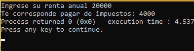

# Unit 2 

Kenya Talí Cornejo Granados
   
<h2>Exercises:  </h2>
<e1>
<li>01_Rentas</li>
<li>02_Rendimiento</li> 
<li>03_SalaJuegos</li>
<li>04_Pizzería</li>
<li>05_Temperaturas</li> 
<li>05_Compras</li> 
<li>06_BinDec</li> 
</e>
  
<h2>01_Rentas </h2>

___    
This code shows how many taxes you are going to pay depending on how much you pay for rent in a year.  
[Rentas code](https://github.com/UP210043/UP210043_CPP/blob/main/U2/01_rentas.cpp)   
   

<h2>02_Rendimiento </h2>

___    
This code shows the punctuation of the employees of a  company and how money they are going to get based on their punctuation.  
[Rendimiento code](https://github.com/UP210043/UP210043_CPP/blob/main/U2/02_rendiminto.cpp)  
 

<h2>03_SalaJuegos </h2>

___    
This code shows how many money a game room is going to charge to the people based on their age.  
[Sala de juegos code](https://github.com/UP210043/UP210043_CPP/blob/main/U2/03_salaJuegos.cpp)  
   
<h2>04_Pizzeria </h2>

___    
This code if to know how a client wants their pizza if they want it vegeterian or not, and shows wich ingredients the pizza is going to have.  
[Pizzeria code](https://github.com/UP210043/UP210043_CPP/blob/main/U2/04_pizzeria.cpp)  
  

<h2>05_Temperaturas </h2>

___    
This code is to get 6 temperatures, find the mean, and get wich is the minimum an the maximum temperature registered.  
[Temperaturas code](https://github.com/UP210043/UP210043_CPP/blob/main/U2/05_Temperaturas.cpp)  

<h2>06_Compras </h2>

___    
In this code you can add as many prices of items as you want and the amount of items you are getting until you enter a 0, then, the program is going to show you your total to pay.  
[Compras code](https://github.com/UP210043/UP210043_CPP/blob/main/U2/06_compras.cpp)  

<h2>07_BinDec </h2>

___    
This code is a converter from binary numbers to decimal numbers.  
[Binario a decimal code]()  
