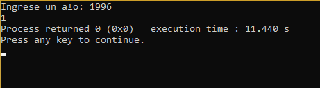
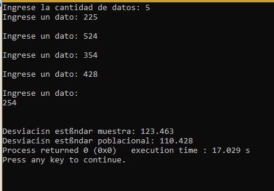
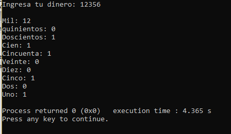
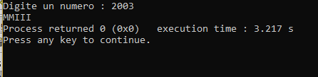
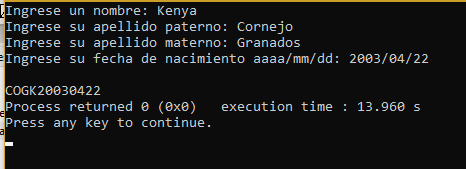
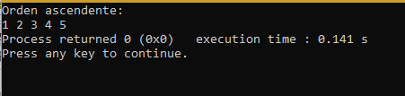
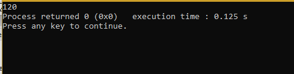

# Unit 2   
<center>Kenya Talí Cornejo Granados</center>   
<h2>Exercises:  </h2>
<e1>
<li>01_Bisección</li>
<li>02_Bisiesto</li> 
<li>04_Desviación</li>
<li>05_Desgloce</li>
<li>06_Romano</li> 
<li>07_RFC</li>
<li>08_VectorOrdenar</li>
<li>09_Recursividads</li>
</e>
  
<h2>01_Bisección </h2>

___    
 
[Bisección code](https://github.com/UP210043/UP210043_CPP/blob/main/U3/01_Bisecci%C3%B3n.cpp)   
```
#include <iostream>
#include <cmath>
using namespace std;

// x^2 + 8x + 15
double fnecu1(double x)
{ 
    return (pow(x, 2) - 8 * x + 15);
}
int main()
{
    double x1 = -10;
    double x2 = 4.5;
    double xn, r;

    double es = .0001;         // Error estandar
    double er = abs(x2 - x1); // Error relativo

    int i = 1;

    while (er > es)
    {

        xn = (x1 + x2) / 2;

        if (fnecu1(x1) * fnecu1(xn) < 0)
        {

            x2 = xn;
        }
        else
        {
            x1 = xn;
        }

        er = abs(x2 - x1);
        i = i + 1;
    }
    cout << "i= " << i << "  raiz=  " << xn << endl;
    return 0;
} 
```  
     

<h2>02_Bisiesto </h2>

___    
  
[Bisiesto code](https://github.com/UP210043/UP210043_CPP/blob/main/U3/02_Bisiseto.cpp)
 ```
#include <iostream>
#include <conio.h>
using namespace std;

int bisiesto(int);
int main(){

	int year;
	
	cout<<"Ingrese un año: ";
	cin>>year;

	cout<<bisiesto(year);
	
	return 0;
}


int bisiesto(int year){
	
	int bisiesto = 0;
	if(year%400==0 || (year%4==0 && year%100!=0)){
		bisiesto = 1;
	}
	return bisiesto;
}
```
 

<h2>04_Desviación </h2>

___    
  
[Desciación estándar code](https://github.com/UP210043/UP210043_CPP/blob/main/U3/04_Desviaci%C3%B3n.cpp)  
```
#include <iostream>
#include <math.h>
#include <conio.h>
using namespace std;


void desv(float );

int main(){
	float n;
	cout<<"Ingrese la cantidad de datos: ";cin>>n;
	
	desv(n);
	
	return 0;
}

void desv(float n){
	
	float var = 0, prom = 0, suma = 0, s = 0, dv = 0;
	
	
	float datos[100];
	
	for(int i = 0; i < n; i++){
		
		cout<<"Ingrese un dato: ";cin>>datos[i];
        cout<<endl;
	}


	for (int i = 0; i < n; i++)
	{
		s = s + datos[i];
	}
	
	prom = s/n;
	for (int i = 0; i < n; i++)
	{
		 suma = suma + (pow((datos[i] - prom),2));
		 
	}
	
	
	var = suma/(n-1);
	dv = sqrt(var);
	
	
	cout<<"\nDesviación estándar muestra: "<<dv;
	var = suma/(n);
	dv = sqrt(var);
	cout<<"\nDesviación estándar poblacional: "<<dv;
}
```
 

<h2>05_Desgloce </h2>

___    
  
[Desgloce code](https://github.com/UP210043/UP210043_CPP/blob/main/U3/05_Desgloce.cpp)  
```
#include <iostream>
#include <conio.h>
using namespace std;

void desgloce(int money);

int main(){
	
	int money;
	
	cout<<"Ingresa tu dinero: ";cin>>money;
	
	desgloce(money);
	
	return 0;
}


void desgloce(int dinero){
	int  mil = 0, quinientos = 0, doscientos = 0, cien = 0, cincuenta = 0, veinte = 0, diez = 0, cinco = 0,dos = 0, uno = 0;	
	mil = dinero /1000;
	dinero %= 1000; 
	quinientos = dinero /500;
	dinero %= 500; 
	doscientos = dinero /200;
	dinero %= 200; 
	cien = dinero/100;
	dinero %= 100;
	cincuenta = dinero/50;
	dinero %= 50;
	veinte = dinero/20;
	dinero %= 20;
	diez = dinero/10;
	dinero %= 10;
	cinco = dinero/5;
	dinero %= 5;
	dos = dinero/2;
	dinero %= 2;
	uno = dinero/1;
	
	
	cout<<endl;
	cout<<"Mil: "<<mil<<endl;
	cout<<"quinientos: "<<quinientos<<endl;
	cout<<"Doscientos: "<<doscientos<<endl;
	cout<<"Cien: "<<cien<<endl;
	cout<<"Cincuenta: "<<cincuenta<<endl;
	cout<<"Veinte: "<<veinte<<endl;
	cout<<"Diez: "<<diez<<endl;
	cout<<"Cinco: "<<cinco<<endl;
	cout<<"Dos: "<<dos<<endl;
	cout<<"Uno: "<<uno<<endl;
}
```
  

<h2>06_Romano </h2>

___    
  
[Romano code](https://github.com/UP210043/UP210043_CPP/blob/main/U3/06_Romano.cpp)  
```
#include <iostream>
#include <conio.h>
using namespace std;

void numRomano(int &);

int main(){
	
	int n;
	
	cout<<"Digite un numero : ";cin>>n; 
	
	numRomano(n);
	
	
	return 0;
}

void numRomano(int &n){
	
	int u, d, c, m;
	
	u = n%10; n /= 10;
	d = n%10; n /= 10; 
	c = n%10; n /= 10; 
	m = n%10; n /= 10; 
	
	switch(m){
		case 1: cout<<"M";break;
		case 2: cout<<"MM";break;
		case 3: cout<<"MMM";break;
	}
	
	switch(c){
		case 1: cout<<"C";break;
		case 2: cout<<"CC";break;
		case 3: cout<<"CCC";break;
		case 4: cout<<"CD";break;
		case 5: cout<<"D";break;
		case 6: cout<<"DC";break;
		case 7: cout<<"DCC";break;
		case 8: cout<<"DCCC";break;
		case 9: cout<<"CM";break;
	}
	
	switch(d){
		case 1: cout<<"X";break;
		case 2: cout<<"XX";break;
		case 3: cout<<"XXX";break;
		case 4: cout<<"XL";break;
		case 5: cout<<"L";break;
		case 6: cout<<"LX";break;
		case 7: cout<<"LXX";break;
		case 8: cout<<"LXXX";break;
		case 9: cout<<"XC";break;
	}
	switch(u){
		case 1: cout<<"I";break;
		case 2: cout<<"II";break;
		case 3: cout<<"III";break;
		case 4: cout<<"IV";break;
		case 5: cout<<"V";break;
		case 6: cout<<"VI";break;
		case 7: cout<<"VII";break;
		case 8: cout<<"VIII";break;
		case 9: cout<<"IX";break;
	}
}
```
  
<h2>07_RFC </h2>

___    
  
[RFC code](https://github.com/UP210043/UP210043_CPP/blob/main/U3/07_RFC.cpp)  
```
#include <iostream>
#include <conio.h>
#include <string.h>
using namespace std;

void RFC(char nombre[], char apellido_paterno[], char apellido_materno[],char fecha[], int);

int main(){
	const int TAM = 30;
	char nombre[TAM], aPaterno[TAM], aMaterno[TAM], fecha[TAM];
	
	
	
	cout<<"Ingrese un nombre: ";
	cin.getline(nombre,TAM,'\n');
	cout<<"Ingrese su apellido paterno: ";
	cin.getline(aPaterno,TAM,'\n');
	cout<<"Ingrese su apellido materno: ";
	cin.getline(aMaterno,TAM,'\n');
	cout<<"Ingrese su fecha de nacimiento aaaa/mm/dd: ";
	cin.getline(fecha,TAM,'\n');
	
	RFC(nombre,aPaterno,aMaterno,fecha,TAM);
	
	
	return 0;
}

void RFC(char nombre[], char aPaterno[], char aMaterno[],char fecha[],int TAM){
	
	char RFC[20];
	
	bool vocal = false;
	int tam, tamy, c = 0;
	strupr(nombre);
	strupr(aPaterno);
	strupr(aMaterno);
	tam = strlen(nombre);
	RFC[0] = aPaterno[0];
		for(int i = 1; i <= tam; i++){
		
		if(vocal == false){
		switch(aPaterno[i]){
			case 'A' : RFC[1] = aPaterno[i] ; vocal = true;break;
			case 'E' : RFC[1] = aPaterno[i] ; vocal = true;break;
			case 'I' : RFC[1] = aPaterno[i] ; vocal = true;break;
			case 'O' : RFC[1] = aPaterno[i] ; vocal = true;break;
			case 'U' : RFC[1] = aPaterno[i] ; vocal = true;break;
		}
		}
	}
	
	RFC[2] = aMaterno[0];
	RFC[3] = nombre[0];
	
	tamy = strlen(fecha);

	for(int i=0;i<10;i++){
		if(fecha[i] != '/'){
			RFC[4+c] = fecha[i];
			c++;
		}
	}

	cout<<endl<<RFC;
	
}

```
  
<h2>08_Ordenar Vector </h2>

___    
  
[Ordenar vector code](https://github.com/UP210043/UP210043_CPP/blob/main/U3/05_Desgloce.cpp)  
```
#include<conio.h>
#include<iostream>
using namespace std;


int main(){
	
	int num[] = {4,1,2,3,5};
	int i,j, aux;
	
	//Método burbuja
	for(i= 0; i <5; i++){
		for(j= 0; j <5; j++){
			if(num[j] > num[j + 1]){
				aux = num[j];
				num[j] = num[j+1];
				num[j+1] = aux;
			}
		}
	}
	
	cout<<"Orden ascendente: "<<endl;
		
		for(i = 0; i <5; i++){
			cout<<num[i]<<" ";
		}
		
	
	return 0;
}
```
  
<h2>09_Recursividad </h2>

___    
  
[Desgloce code](https://github.com/UP210043/UP210043_CPP/blob/main/U3/09_Recursividad.cpp)  
```
#include <iostream>
#include <conio.h>
using namespace std;


int fact(int n);


int main(){
	
	cout<<fact(5);
	
	
	
	return 0;
}

int fact(int n){
	
	if(n == 0){
		n = 1;
	}else{
		
		n = n * fact(n-1);
	}
	
	return n;
}
```
  
